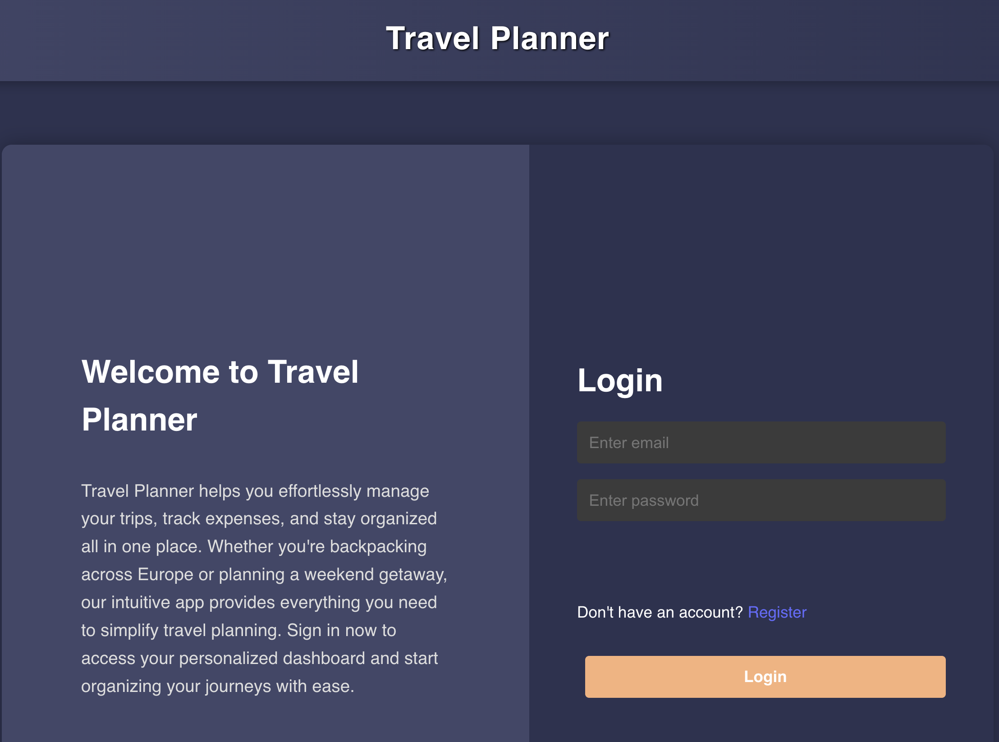

# Assignment3 - Construct a Front-End Web Application

# Diploma of Web Development at CoderAcademy - Cohort October 2024


### 16020 - Tsai-Chi Yang
### 15524 - Hernan Velasquez
### 16011 - Jessica Amy

## Table of contents

1. [AirBnB JavaScript Style Guide](#airbnb-javascript-style-guide)
-  [Usage in the Travel Planner code](#usage-in-the-travel-planner-code)

2. [How to run the Travel Planner application locally](#how-to-run-the-travel-planner-application-locally)

3. [Dependent software and packages](#dependent-software-and-packages)
-  [Core Dependencies](#core-dependencies)
-  [Development dependencies](#development-dependencies)

4. [Hardware requirements](#hardware-requirements)
5. [Comparisons to alternative technology choices](#comparisons-to-alternative-technology-choices)
6. [Purposes of chosen technologies](#purposes-of-chosen-technologies)
7. [Licensing of chosen technologies](#licensing-of-chosen-technologies)
8. [References](#references)

---
## AirBnB JavaScript Style Guide

The code of the Travel Planner Web Application is written following the **Airbnb JavaScript Style Guide**(Airbnb, 2025)[^1], to facilitate readability, safe JavaScript practices, and seamless interaction among coders that might want to inspect this source in the future.

### Usage in the Travel Planner code

The use of the **Airbnb JavaScript Style Guide** is mainly focused on mantaining readability, naming conventions, designing clear and functional components, simple and meaningful comments, *PascalCase* for components, and *camelCase* for prop names.

## How to run the Travel Planner application locally

- Repo in GitHub to the [Travel Planner Server](git@github.com:Angie-newbie/TravelPlanner_App_Backend.git)
- Repo in GitHub to the [Travel Planner Client](git@github.com:hernan-vela/TravelPlanner_App_Frontend.git)

To run the web application from your local machine, first clone both repositories ==>

Server:
``` git clone git@github.com:Angie-newbie/TravelPlanner_App_Backend.git```

Client:
```git clone git@github.com:hernan-vela/TravelPlanner_App_Frontend.git```

Second, using your preferred source code editor, open both the **Client** and and **Server** project folders in separate windows or tabs. Then, open a separate terminal for each project and run ```npm install```. This will install all the software dependencies and packages required for the web application to operate flawless.

Third, from the terminal of the Server folder, run the command ```npm run dev```. As a result the server will connect, and a confirmation message will be displayed on your terminal environment, such as:

```terminal
developer@localMachine TravelPlanner_App_Backend % npm run dev

  > travelplanner_app_backend@1.0.0 dev
  > node --watch src/index.js

  Example app listening on port 4000
  Mongoose connected
```

Fourth, execute the same command, ```npm run dev```, from the terminal of the Client folder. In this case, you will see this displayed on your screen:

```terminal
VITE v6.3.5  ready in 214 ms

  ➜  Local:   http://localhost:5173/
  ➜  Network: use --host to expose
  ➜  press h + enter to show help
```

Finally, open the url in your browser and you will be redirected to the login page. You can click on *'register'* to create a new user and follow the prompts to interact with the Travel Planner.


*Login web page of the Travel Planner app*

## Dependent Software and Packages

This project uses software packages which enhance a friendly user interaction, straigthforward client and server communication, data security, and responsivenes.

### Core Dependencies

- **joi (^17.13.3)** --> robust schema-based validation library for JavaScript. It is used to validate login credentials making sure the user is allowed to perform certain operations in the app. Joi enforces that data shape and type, reducing problems for incorrect user input (Joi, 2025)[^2].

- **jwt-decode (^4.0.0)** --> it helps to decode the JSON Web Token without verfing their signature, by-passing the need to re-authenticate when extracting key such as email, role, and user ID(npm, 2023)[^3].

- **React (^19.1.0)** --> main library that allows to build user interfaces in the Travel Planer application. It provides the building blocks as components, hooks, among others for rendering the UI and user interaction (React, 2023)[^4]

- **react-dom (^19.1.0)** --> this package provides methods tailored for the DOM, to render the application directly in the browser, functionalities such as faster pre-loading of scripts, CSS filess, fonts, and rendering the app into the #root (React, 2025)[^5].

- **react-responsive (^10.0.1)** --> component-based for website adaptability to different size device. Media-query behaviour directly in JavaScript/JSX (npm, 2023)[^6].

- **npm (^11.4.1)** --> Node Package Manager (npm), it is the default package manager for *Node.js*, adapts packages of code for the app, run packages without dowloading. Commonly, it is used through the CLI 

- **react-router-dom (^7.6.1)** --> it facilitates client-side routing, allowing the users jump between web pages without a full page reaload. Usually, it is quite relevant for handling routes that share common layout (React Router, 2025)[^7]


### Development Dependencies

- **babel/preset-env(^7.27.2)** --> Dependency to translate modern JavaScript to the older version of the language, according to the browse in which the app will be run. It ensures functionality among different browsers (Babel, ).

- **Jest(^29.7.0)** --> Simple JavaScript testing framework, employed to run testing files, mock functions and establish expected results in the app. Simple to set up, no complex configuration needed  (Jest, 2025)[^8]

- **jest-environment-jsdom (^30.0.0-beta.3)** --> Simulated environment similar to a browser with window, document, DOM to implement Jest testing (npm, 2025)[^9].

- **Vite (^6.3.5)** -->  Build tool and development server, provides faster and simple functionalities for modern web applications. It includes native support for ES modules, HMR and tree-shaking (Vite, 2025)[^10].


## Hardware Requirements

For local development, the next components are recommended:

| Component | Hardware Requirement |
| - | - |
| CPU |  Dual-core 2.0 GHz (Intel i3 / AMD equivalent) |
| RAM | **4 GB** minimun (server and client) |
| Storage | **500 MB** free space (coding + node_modules) |
| OS | Windows 10+, macOS Catalina+, or any modern Linux distro |
| Browser | Any Chromim-based browser (Chrome/Edge) or Firefox |

Considering that The Travel Planner is a ligthweight program, it might not need the latest technologies to run properly, but below it is shown a list of how some dependencies affect the resources:

| Dependency | Impact |
|  -  |  -  |
| React 19 | Runs great with Vite / require minimal runtime memory |
| Vite | Fast builds, low memory consumption (~200MB during dev) |
| MongoDB (local) | during queries uses 300-500MB |
| Jest | Test runs might spike RAM momentarily |
| Babel | Used during dev, can consume 300-500MB top during builds |

## Comparisons to alternative technology choices

Although this project was initially conceived using MERN stack, it is reasonable to consider alternative techonologies for future developments. Here there is a brief comparison:

### React vs. Vue.js

| Criteria | React | Vue.js |
| - | - | - |
| **Characteristics** | Component-based UI library focused in declarative rendering an state management | Progressive framework with reactivity system and integrated tooling |
| **Pros**| Massive ecosystem, job market, strong community support, flexible integration with other libraries | Simpler syntax, fast setup and learning curve, integrated features  |
| **Cons** | Requires more boilerplate for state an forms, tough learning curve for beginners, JSX syntax may feel excesive | Smaller ecosystem in contrast,  newer community = less experience, hardly adopted by companies |
Source: State of JS, 2023[^11]

### React vs. Angular

| Criteria | React | Angular |
| - | - | - |
| **Characteristics** | Component-based UI library focused in declarative rendering and hooks | Framework built with TypeScript, built-in routing, state and HTTP services |
| **Pros** | Massive ecosystem, strong community, flexible with other libraries, backed by Meta | Built-in features, great for enterprise-scale apps, supported by Google. |
| **Cons** | Tougher learning curveS with JSX and state management; requires more setup for full-stack capabilities. | Heavyweight; steeper learning curve due to TypeScript, decorators, and RxJS complexity. |
Source: (State of JS, 2023)[^11]

### React vs. Svelte

| Criteria | React | Svelte |
| - | - | - |
| **Characteristics** | Component-based UI library focused in declarative rendering and hooks | Compiler-based framework that converts components into vanilla JS at build time |
| **Pros** | Massive ecosystem, strong community, flexible with other libraries, backed by Meta | Very fast, small bundles, no virtual DOM, simpler syntax. |
| **Cons** | Requires a build step for JSX; runtime abstraction may lead to performance tradeoffs | Smaller ecosystem, fewer jobs, less mature tooling compared to React |
Source: (State of JS, 2023)[^11], (Svelte in GitHub, 2025)[^12]

### React Router vs. Reach Router

| Criteria | React | Svelte |
| - | - | - |
| **Characteristics** | Feature routing library for React with nested routing, route loaders and data APIs | Lightweigh route focused on accessibitlity and simplicity |
| **Pros** | Built-in support for nested layouts and loaders, mantained and widely adopted, rich ecosystem | Simpler syntax, smaller bundle size, automated route handling accessibility |
| **Cons** | Tough to learn, boilerplate in dynamic routing | No longer actively mantained or recommended for new projects |


## Purposes of chosen technologies

The chosen technology for this project comprises relevant characteristics, especially those advantageous for the app's functionalities. Some of these characteristics are:

- **React** is ideal because it facilitates faster building of reusable components such as pop-up windows and page containers. In addition, the number of tutorials, documentation, and packages available online makes it easier to learn about React's use.

- **react-router-DOM** enables the seamless client-side navigation between pages such as ```login```, ```trips```, ```create```, without reloading the whole page after every transition. It supports dynamic routing, and its designs fits naturally with React components. In general, it provides the flexibility and efficiency needed for building a responsive single-page application.

- **jwt-decode** allows to extract user data from tokens without calling the backend. Small and lightweight.

- **Vite (Bundler/Dev Server)** uses Hot Module Replacement (HMR), it is optimised for development and uses tree-shaking to discard the modules that the application do not use.

- **react-responsive** exhibits a granular control, which eases the building of different layouts for the most relevant devices, such as Mobile, desktop and tablets.

- **Jest + babel-jest - jsdom** enable reliable unit testing of logic, API calls, and user interactions. This setup makes it easy to mock tokens and endpoints, allowing tests to run in isolation. The simulated DOM, provided by jsdom, makes possible to test React components without an actual browser.


## Licensing of chosen technologies

The technologies use in the development of this Travel Planner web application, hold MIT License, allowing their free use, modification and distribution.

| Package             | License | License URL                                                      |
|---------------------|---------|------------------------------------------------------------------|
| react               | MIT     | https://github.com/facebook/react/blob/main/LICENSE              |
| react-dom           | MIT     | https://github.com/facebook/react/blob/main/LICENSE              |
| react-router-dom    | MIT     | https://github.com/remix-run/react-router/blob/dev/LICENSE       |
| react-responsive    | MIT     | https://github.com/yocontra/react-responsive/blob/master/LICENSE |
| jwt-decode          | MIT     | https://github.com/auth0/jwt-decode/blob/master/LICENSE          |
| vite                | MIT     | https://github.com/vitejs/vite/blob/main/LICENSE                 |
| jest                | MIT     | https://github.com/jestjs/jest/blob/main/LICENSE                 |
| babel-jest          | MIT     | https://github.com/babel/jest/blob/main/LICENSE                  |
| jsdom               | MIT     | https://github.com/jsdom/jsdom/blob/master/LICENSE.txt           |
| eslint              | MIT     | https://github.com/eslint/eslint/blob/main/LICENSE               |


## References 

[^1]: Airbnb, JavaScript 2025 on GitHub, *Airbnb JavaScript Style Guide*, accessed on 10 May 2025, https://github.com/airbnb/javascript

[^2]: Joi, 2025, *Joi Documentation*, accessed on 01 June 2025, https://joi.dev/api/?v=17.13.3

[^3]: npm, 2023, *jwt-decode*, accessed on 01 June 2025, https://www.npmjs.com/package/jwt-decode

[^4]: React, 2025, *React, The library for web and native user interface*, accessed on 01 June 2025, https://react.dev/

[^5]: React, 2025, *React DOM APIs*, accessed on 01 June 2025, https://react.dev/reference/react-dom

[^6]: npm, 2023, *react-responsive*, accessed on 06 June 2025, https://www.npmjs.com/package/react-responsive

[^7]: React Router, 2025, *REACT ROUTER*, accessed on 01 June 2025, https://reactrouter.com/

[^8]: Jest on Github, 2025, Delightful JavaScript Testing, accessed on 5 May 2025, https://github.com/jestjs/jest

[^9]: npm, 2025, *jest-environment-jsdom*, accessed on 06 June 2025, https://www.npmjs.com/package/jest-environment-jsdom

[^10]: Vite, 2025, *Vite, The Build Tool for the Web*, accessed on 06 June 2025, https://vite.dev/

[^11]: State of JS, 2023, *Libraries*, accessed on 06 June 2025, https://2023.stateofjs.com/en-US/libraries/

[^12]: Svelete in GiHub, 2025, *sveltejs / svelte*, accessed on 06 June 2025, https://github.com/sveltejs/svelte